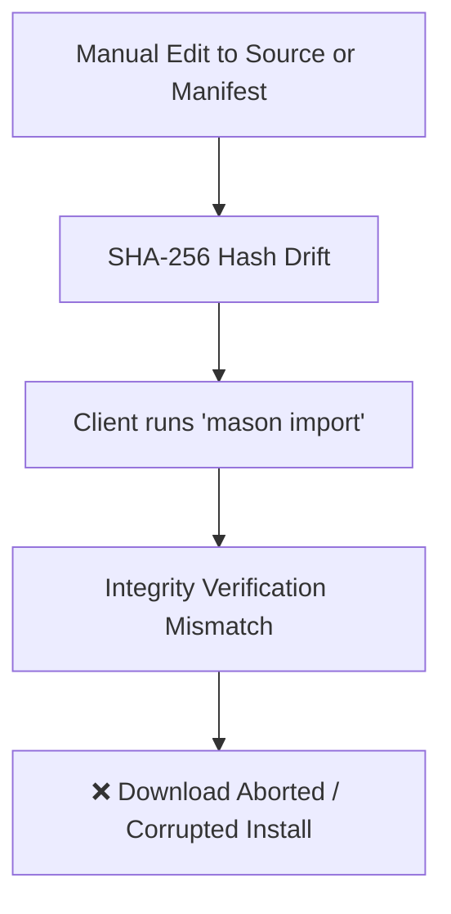
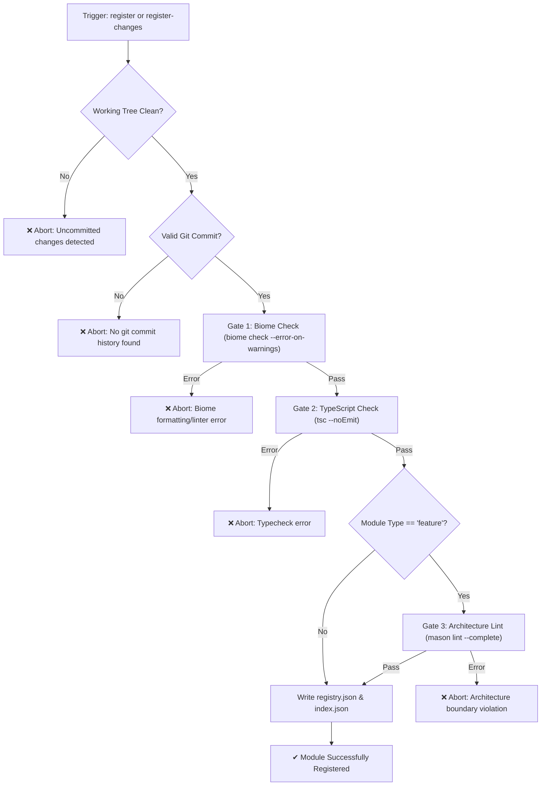
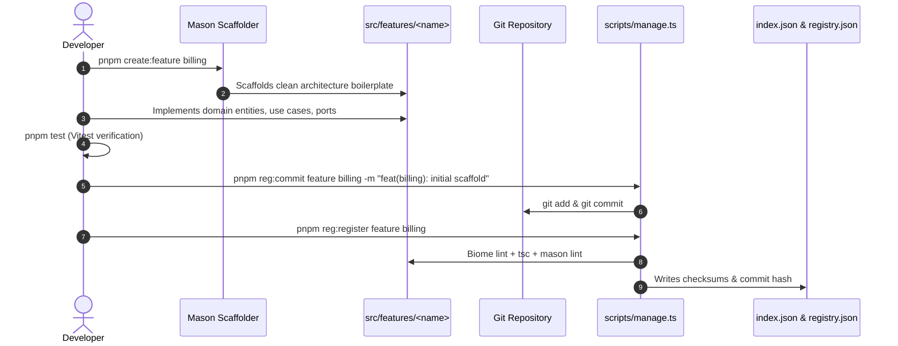

# Mason Registry Management CLI (`scripts/manage.ts`)

Full operational documentation for the Mason Registry management tool located at [`scripts/manage.ts`](file:///home/erwin/Documents/solid-stack-digital/test/ssd-ecosystem/mason-registry/scripts/manage.ts).

This script provides both an **interactive terminal UI** (powered by `@clack/prompts` and `picocolors`) and a **headless/non-interactive CLI** for managing module lifecycles, computing cryptographic checksums, committing changes, enforcing quality gates, and maintaining master index files.

---

## Table of Contents

- [Overview & Purpose](#overview--purpose)
- [Why Direct File Modification is Prohibited](#why-direct-file-modification-is-prohibited)
- [Architecture & Core Concepts](#architecture--core-concepts)
  - [Module Discovery & Target Folders](#module-discovery--target-folders)
  - [Deterministic SHA-256 Integrity Hashing](#deterministic-sha-256-integrity-hashing)
  - [Decoupled Git Commit Pinning](#decoupled-git-commit-pinning)
  - [Pre-Registration Quality Gates](#pre-registration-quality-gates)
  - [Registry Drift States](#registry-drift-states)
- [Data Structures & Schemas](#data-structures--schemas)
  - [Module Manifest (`registry.json`)](#module-manifest-registryjson)
  - [Master Index (`index.json`)](#master-index-indexjson)
  - [Registry Module Status (`RegistryModuleStatus`)](#registry-module-status-registrymodulestatus)
- [Command Reference](#command-reference)
  - [Command Summary & npm Aliases](#command-summary--npm-aliases)
  - [Interactive Mode (Root Launcher)](#interactive-mode-root-launcher)
  - [1. Status & Drift Inspection (`status` / `diff`)](#1-status--drift-inspection-status--diff)
  - [2. Module Registration (`register`)](#2-module-registration-register)
  - [3. Staging & Committing Changes (`commit`)](#3-staging--committing-changes-commit)
  - [4. Registering Changes (`register-changes` / `update`)](#4-registering-changes-register-changes--update)
  - [5. Unregistering Modules (`unregister`)](#5-unregistering-modules-unregister)
- [Developer Workflows](#developer-workflows)
  - [Workflow A: Creating & Registering a New Module](#workflow-a-creating--registering-a-new-module)
  - [Workflow B: Updating an Existing Module](#workflow-b-updating-an-existing-module)
  - [Workflow C: Unregistering / Deprecating a Module](#workflow-c-unregistering--deprecating-a-module)
- [Comparison: `manage.ts` vs `build.ts`](#comparison-managets-vs-buildts)
- [Troubleshooting & Quality Gate Errors](#troubleshooting--quality-gate-errors)

---

## Overview & Purpose

The Mason Registry hosts reusable, production-ready modules conforming to Solid Stack Clean Architecture. These modules are distributed to consumer applications via the `mason import` CLI.

[`scripts/manage.ts`](file:///home/erwin/Documents/solid-stack-digital/test/ssd-ecosystem/mason-registry/scripts/manage.ts) acts as the operational custodian of the registry. It guarantees that:
1. Every module published to the registry is in a valid git commit.
2. Every file payload matches its recorded SHA-256 integrity digest.
3. Every module strictly satisfies Biome linting, TypeScript compilation, and Mason Clean Architecture dependency boundaries.
4. The master catalog ([`index.json`](file:///home/erwin/Documents/solid-stack-digital/test/ssd-ecosystem/mason-registry/index.json)) and individual module manifests ([`registry.json`](file:///home/erwin/Documents/solid-stack-digital/test/ssd-ecosystem/mason-registry/src/features/authn/registry.json)) remain deterministically formatted and sorted.

---

## Why Direct File Modification is Prohibited

You must **never** manually edit [`index.json`](file:///home/erwin/Documents/solid-stack-digital/test/ssd-ecosystem/mason-registry/index.json) or any module's `registry.json`. Both are managed artifacts maintained exclusively by [`scripts/manage.ts`](file:///home/erwin/Documents/solid-stack-digital/test/ssd-ecosystem/mason-registry/scripts/manage.ts) and [`scripts/build.ts`](file:///home/erwin/Documents/solid-stack-digital/test/ssd-ecosystem/mason-registry/scripts/build.ts).



1. **SHA-256 Integrity Verification**: During `mason import`, the client recalculates the SHA-256 checksum of incoming files against the registry's recorded hash. A single whitespace difference or manual version update invalidates this check.
2. **Git Commit Hash Verification**: The registry records the exact git commit SHA for auditability and reproducible releases.
3. **Quality Gate Bypassing**: Manual edits bypass automated typechecks, architecture boundary validation, and strict lint checks, introducing broken modules into consumer projects.

---

## Architecture & Core Concepts

### Module Discovery & Target Folders

The registry organizes code into two module types:
- **`shared`**: Reusable technical primitives and cross-cutting adapters (e.g. [`src/shared/time`](file:///home/erwin/Documents/solid-stack-digital/test/ssd-ecosystem/mason-registry/src/shared/time), [`src/shared/jwt`](file:///home/erwin/Documents/solid-stack-digital/test/ssd-ecosystem/mason-registry/src/shared/jwt), [`src/shared/hasher`](file:///home/erwin/Documents/solid-stack-digital/test/ssd-ecosystem/mason-registry/src/shared/hasher)).
- **`feature`**: Domain capabilities implementing full Clean Architecture layers (e.g. [`src/features/authn`](file:///home/erwin/Documents/solid-stack-digital/test/ssd-ecosystem/mason-registry/src/features/authn), [`src/features/mailing`](file:///home/erwin/Documents/solid-stack-digital/test/ssd-ecosystem/mason-registry/src/features/mailing)).

#### Folder Resolution Logic (`getTargetFolder`):
1. Reads [`mason.config.json`](file:///home/erwin/Documents/solid-stack-digital/test/ssd-ecosystem/mason-registry/mason.config.json) if present:
   - For `shared`: `config.paths.shared` (default: `"src/shared"`)
   - For `feature`: `config.paths.features` (default: `"src/features"`)
2. Fallbacks to `src/shared` or `src/features`.
3. Fallbacks to root `./shared` or `./features`.

#### Module Discovery (`discoverDiskModules`):
Traverses the resolved directories and returns all subdirectories, automatically ignoring dotfiles/directories (such as `.git`).

---

### Deterministic SHA-256 Integrity Hashing

The integrity hash guarantees cryptographic tamper-proofing across different operating systems and environments.

#### Calculation Engine (`computeDirectoryHash` & `collectSourceFiles`):
1. **File Filtering**:
   - Collects all source files under the module directory.
   - **Excludes**:
     - `registry.json` (the manifest itself)
     - `__tests__/` directory
     - `*.test.ts` and `*.spec.ts` files
     - Hidden files (starting with `.`)
2. **Deterministic Sorting**:
   - The relative file list is sorted lexicographically (`files.sort()`).
3. **Cross-Platform Normalization**:
   - CRLF line endings (`\r\n`) are normalized to LF (`\n`) before hashing:
     ```ts
     const normalizedContent = content.replace(/\r\n/g, "\n");
     ```
4. **Digest Generation**:
   - Updates the SHA-256 hash with each file's relative path and normalized content.
   - Produces the output format: `sha256-<64-char-hex-digest>`.

---

### Decoupled Git Commit Pinning

The registry decouples code commits from registry publication:
- Developers can commit iterative work into git without publishing immediately.
- The management CLI tracks the latest commit hash for a module directory using:
  ```bash
  git log -n 1 --format="%H" -- "<relPath>" ":(exclude)<relPath>/registry.json"
  ```
- **Crucial Detail**: `registry.json` is explicitly excluded from the git log query so that updating metadata never invalidates the recorded commit hash of the module's actual source code.

---

### Pre-Registration Quality Gates

Before any module is written to [`index.json`](file:///home/erwin/Documents/solid-stack-digital/test/ssd-ecosystem/mason-registry/index.json) or its `registry.json` is stamped, [`scripts/manage.ts`](file:///home/erwin/Documents/solid-stack-digital/test/ssd-ecosystem/mason-registry/scripts/manage.ts) runs strict verification gates:



1. **Clean Git Working Tree**: Ensures no unstaged or uncommitted files exist inside the module directory (excluding `registry.json`).
2. **Git Commit History**: Confirms that the module directory has at least one commit in git history.
3. **Gate 1 - Biome Linting**: Runs `pnpm exec biome check --error-on-warnings "<relPath>"`. Must have 0 errors and 0 warnings.
4. **Gate 2 - TypeScript Compilation**: Runs `pnpm exec tsc --noEmit` across the repository.
5. **Gate 3 - Mason Architecture Validation** (for `feature` modules): Runs `pnpm exec mason lint --complete` to enforce Clean Architecture layer rules:
   - Domain must not depend on Infrastructure or Presenters.
   - Use Cases must only import Domain interfaces.
   - No circular dependencies across features.

---

### Registry Drift States

The status command categorizes every module in the workspace into one of five states:

| Glyph | State Category | Condition | Recommended Action |
|:---:|:---|:---|:---|
| 📦 | **Unregistered Modules** | Folder exists on disk in `src/`, but no entry exists in [`index.json`](file:///home/erwin/Documents/solid-stack-digital/test/ssd-ecosystem/mason-registry/index.json). | Run `pnpm reg:register` to add the module. |
| 💾 | **Uncommitted Changes in Git** | Module directory has modified, unstaged, or untracked files in git. | Run `pnpm reg:commit` or commit with standard git commands. |
| 🚀 | **Committed But Unregistered Changes** | Module is committed in git, but local commit SHA or local integrity SHA differs from [`index.json`](file:///home/erwin/Documents/solid-stack-digital/test/ssd-ecosystem/mason-registry/index.json). | Run `pnpm reg:register-changes` to synchronize the catalog. |
| ⚠️ | **Missing on Disk** | Module is registered in [`index.json`](file:///home/erwin/Documents/solid-stack-digital/test/ssd-ecosystem/mason-registry/index.json), but its directory cannot be found on disk. | Restore the source folder or run `pnpm reg:unregister`. |
| ✔ | **Up to Date & Registered** | Clean git tree, matching commit SHA, and matching SHA-256 integrity digest. | No action required. Module is fully synchronised and valid. |

---

## Data Structures & Schemas

### Module Manifest (`registry.json`)

Each module directory contains a `registry.json` manifest specifying its dependencies and deployment metadata:

```json
{
  "name": "authn",
  "type": "feature",
  "description": "Authentication and user identity feature module",
  "version": "1.0.0",
  "integrity": "sha256-55cbfa18fa7ca2d8975de984df6d5952db5607b322da33d5964db59a3eb64f33",
  "commit": "88fee318855ebf88862498965300e7b357c2cdba",
  "dependencies": {
    "npm": ["express", "zod"],
    "shared": ["hasher", "jwt", "time", "uuid"],
    "features": []
  },
  "files": [
    "diProvider.ts",
    "domain/contracts/PasswordHasher.ts",
    "domain/entities/User.ts",
    "domain/errors/AuthnError.ts",
    "infrastructure/BcryptPasswordHasher.ts",
    "pxExpress/authnRouter.ts",
    "useCases/login/LoginUseCase.ts",
    "useCases/login/LoginDto.ts"
  ]
}
```

#### Field Specifications:
- `name` (`string`): Unique module name.
- `type` (`"shared" | "feature"`): Module category.
- `description` (`string`): Brief explanation of the module's responsibility.
- `version` (`string`): Semantic version string (defaults to `"1.0.0"`).
- `integrity` (`string`): Deterministic SHA-256 checksum of source files.
- `commit` (`string`): 40-character git commit SHA corresponding to the module state.
- `dependencies` (`object`):
  - `npm`: Required third-party npm packages.
  - `shared`: Dependent modules in `src/shared/`.
  - `features`: Dependent feature modules in `src/features/` (if permitted).
- `files` (`string[]`): Sorted list of all module files relative to the module root (excluding `registry.json` and hidden files).

---

### Master Index (`index.json`)

Located at the repository root, [`index.json`](file:///home/erwin/Documents/solid-stack-digital/test/ssd-ecosystem/mason-registry/index.json) serves as the primary catalog parsed by `mason import`:

```json
{
  "shared": [
    {
      "name": "hasher",
      "description": "hasher shared module",
      "version": "1.0.0",
      "integrity": "sha256-4277fafe5be4542d131fdf79fc85012354c4146a894676100c5c363919e1c2ec",
      "commit": "88fee318855ebf88862498965300e7b357c2cdba"
    },
    {
      "name": "jwt",
      "description": "jwt shared module",
      "version": "1.0.0",
      "integrity": "sha256-32d56a735e0766ff31a293674fe84f23b246a482b8ae67fa6df8bc2f8ba243f9",
      "commit": "88fee318855ebf88862498965300e7b357c2cdba"
    }
  ],
  "features": [
    {
      "name": "authn",
      "description": "authn feature module",
      "version": "1.0.0",
      "integrity": "sha256-55cbfa18fa7ca2d8975de984df6d5952db5607b322da33d5964db59a3eb64f33",
      "commit": "88fee318855ebf88862498965300e7b357c2cdba"
    }
  ]
}
```

- Both `shared` and `features` arrays are always sorted alphabetically by `name`.
- Formatted with 2-space indentation and a trailing newline.

---

### Registry Module Status (`RegistryModuleStatus`)

TypeScript interface used internally to calculate drifts and render status reports:

```typescript
export interface RegistryModuleStatus {
  name: string;
  type: "shared" | "feature";
  isRegistered: boolean;
  existsOnDisk: boolean;
  hasUncommittedGitChanges: boolean;
  uncommittedFilesCount: number;
  hasIntegrityDrift: boolean;
  hasCommitDrift: boolean;
  localIntegrity?: string | undefined;
  registeredIntegrity?: string | undefined;
  localCommit?: string | undefined;
  registeredCommit?: string | undefined;
}
```

---

## Command Reference

### Command Summary & npm Aliases

| Action | Direct Command (`tsx`) | npm / pnpm Script | Description |
|:---|:---|:---|:---|
| **Interactive Menu** | `pnpm tsx scripts/manage.ts` | — | Launches the interactive Clack CLI menu |
| **Inspect Drift / Status** | `pnpm tsx scripts/manage.ts status`<br/>`pnpm tsx scripts/manage.ts diff` | `pnpm reg:status`<br/>`pnpm reg:diff`<br/>`pnpm status` | Summarizes all registered, unregistered, and drifted modules |
| **Register New Module** | `pnpm tsx scripts/manage.ts register [type] [name]` | `pnpm reg:register` | Validates, hashes, commits metadata, and registers a new module |
| **Commit Module** | `pnpm tsx scripts/manage.ts commit [type] [name] [-m <msg>]` | `pnpm reg:commit` | Stages and commits a module's directory in git |
| **Register Changes** | `pnpm tsx scripts/manage.ts register-changes [type] [name] [-v <ver>]`<br/>`pnpm tsx scripts/manage.ts update ...` | `pnpm reg:register-changes` | Re-runs quality gates, updates checksums and commit hash |
| **Unregister Module** | `pnpm tsx scripts/manage.ts unregister [type] [name]` | `pnpm reg:unregister` | Removes module from `index.json` (preserves source code) |

---

### Interactive Mode (Root Launcher)

When executed without arguments, `manage.ts` renders an interactive selection prompt:

```bash
pnpm tsx scripts/manage.ts
```

```text
🏛️  Mason Registry: What would you like to do?
  ● Inspect Status & Diff (Summary of unregistered, uncommitted, and drifted modules)
  ○ Register Module (Add an existing module to index.json with integrity checksum)
  ○ Commit Changes (Commit a module's working changes to git in the background)
  ○ Register Changes (Update index.json & registry.json with latest checksums)
  ○ Unregister Module (Remove module from index.json; source code stays on disk)
```

Navigation:
- Use **Up/Down arrows** to navigate.
- Press **Enter** to select.
- Press **Ctrl+C** or **Esc** at any time to cancel cleanly (handled via `handleCancel`).

---

### 1. Status & Drift Inspection (`status` / `diff`)

Compares all modules on disk against [`index.json`](file:///home/erwin/Documents/solid-stack-digital/test/ssd-ecosystem/mason-registry/index.json) and git history, displaying an aggregated overview.

#### Usage:
```bash
# Via pnpm script:
pnpm reg:status
pnpm reg:diff
pnpm status

# Via tsx directly:
pnpm tsx scripts/manage.ts status
pnpm tsx scripts/manage.ts diff
```

#### Example Output:
```text
📋 Mason Registry Diff & Status Summary

📦 Unregistered Modules (1):
  ● feature/notifications (not registered in index.json)

💾 Uncommitted Changes in Git (1):
  ▲ feature/authn (3 modified/untracked files)

🚀 Committed But Unregistered Changes (1):
  ◆ shared/time (commit: 88fee31 != registered: 7a4b12c, integrity: sha256-4277fafe5be4...)

✓ Up to Date & Registered (3):
  ✔ feature/mailing (commit: 88fee31, sha256-89d12a34...)
  ✔ feature/otp (commit: 88fee31, sha256-55cbfa18...)
  ✔ shared/uuid (commit: 88fee31, sha256-11ac45de...)
```

---

### 2. Module Registration (`register`)

Registers an unregistered module into [`index.json`](file:///home/erwin/Documents/solid-stack-digital/test/ssd-ecosystem/mason-registry/index.json) and creates/updates its `registry.json`.

#### Interactive Mode:
```bash
pnpm reg:register
```
1. Prompts for module type: `Feature` or `Shared Module`.
2. Lists unregistered modules discovered on disk (or lets you enter a custom name).
3. Executes quality gates (Biome, TypeScript, Mason architecture).
4. Computes SHA-256 integrity hash and file inventory.
5. Updates [`index.json`](file:///home/erwin/Documents/solid-stack-digital/test/ssd-ecosystem/mason-registry/index.json) and writes `registry.json`.

#### Headless / Non-Interactive Mode:
```bash
# Syntax: pnpm tsx scripts/manage.ts register <type> <name>
pnpm tsx scripts/manage.ts register feature authn
pnpm tsx scripts/manage.ts register shared hasher
```

#### Pre-conditions Checked:
- Directory must exist at `src/<type>/<name>`.
- Git tree must be clean (no uncommitted modifications).
- Git commit history must exist.
- Biome check, TypeScript compilation, and Mason architecture check must pass with 0 errors.

---

### 3. Staging & Committing Changes (`commit`)

Stages and commits changes for a specific module directory in isolation without affecting other modules in the workspace.

#### Interactive Mode:
```bash
pnpm reg:commit
```
1. Prompts for module type (`Feature` or `Shared Module`).
2. Lists modules with hint indicators showing how many uncommitted files each has.
3. If no changes exist, warns and exits safely.
4. Prompts for commit message.
5. Stages directory: `git add "<dir>"`.
6. Commits: `git commit -m "<message>" -- "<dir>"`.

#### Headless / Non-Interactive Mode:
```bash
# Syntax: pnpm tsx scripts/manage.ts commit <type> <name> -m "<message>"
pnpm tsx scripts/manage.ts commit feature authn -m "feat(authn): add password reset use case"
pnpm tsx scripts/manage.ts commit shared time -m "feat(time): add timezone offset support"
```

#### Supported Flags:
- `-m "<message>"` or `--message "<message>"`: Commit message string.

---

### 4. Registering Changes (`register-changes` / `update`)

Updates an existing registered module whose source code has been modified and committed.

#### Interactive Mode:
```bash
pnpm reg:register-changes
```
1. Prompts for module type (`Feature` or `Shared Module`).
2. Lists registered modules, highlighting those with `drift detected (needs register)`.
3. Verifies clean working tree and commit history.
4. Runs full quality gates (Biome, TypeScript, Mason architecture).
5. Recomputes file inventory and SHA-256 integrity digest.
6. Synchronizes `registry.json` and [`index.json`](file:///home/erwin/Documents/solid-stack-digital/test/ssd-ecosystem/mason-registry/index.json).

#### Headless / Non-Interactive Mode:
```bash
# Syntax: pnpm tsx scripts/manage.ts register-changes <type> <name> [-v <version>]
pnpm tsx scripts/manage.ts register-changes feature authn
pnpm tsx scripts/manage.ts register-changes shared jwt -v 1.2.0

# Using the 'update' alias:
pnpm tsx scripts/manage.ts update shared uuid -v 1.0.1
```

#### Supported Flags:
- `-v "<version>"` or `--version "<version>"`: Updates the semantic version string in both `registry.json` and `index.json`.

---

### 5. Unregistering Modules (`unregister`)

Removes a module entry from [`index.json`](file:///home/erwin/Documents/solid-stack-digital/test/ssd-ecosystem/mason-registry/index.json).

> [!IMPORTANT]
> Unregistering a module **never** deletes the source files from disk. The source code remains intact in `src/shared/<name>` or `src/features/<name>`.

#### Interactive Mode:
```bash
pnpm reg:unregister
```
1. Prompts for module type (`Feature` or `Shared Module`).
2. Lists registered modules.
3. Removes the selected entry from [`index.json`](file:///home/erwin/Documents/solid-stack-digital/test/ssd-ecosystem/mason-registry/index.json).

#### Headless / Non-Interactive Mode:
```bash
# Syntax: pnpm tsx scripts/manage.ts unregister <type> <name>
pnpm tsx scripts/manage.ts unregister feature old-feature
pnpm tsx scripts/manage.ts unregister shared deprecated-helper
```

---

## Developer Workflows

### Workflow A: Creating & Registering a New Module



1. **Scaffold the module**:
   ```bash
   pnpm create:feature billing
   # or for shared:
   pnpm create:shared crypto
   ```
2. **Implement code and tests**:
   Develop your domain logic and write Vitest unit tests in `__tests__/` or `*.test.ts`. Ensure all tests pass:
   ```bash
   pnpm test
   ```
3. **Commit module code to git**:
   ```bash
   pnpm reg:commit feature billing -m "feat(billing): implement subscription management"
   ```
4. **Register the module**:
   ```bash
   pnpm reg:register feature billing
   ```
5. **Commit the generated manifests**:
   ```bash
   git add index.json src/features/billing/registry.json
   git commit -m "chore(registry): register feature billing"
   ```

---

### Workflow B: Updating an Existing Module

When making bugfixes, adding use cases, or updating dependencies:

1. **Edit source files** in `src/features/<name>` or `src/shared/<name>`.
2. **Verify status**:
   ```bash
   pnpm reg:status
   ```
   The module will appear under `💾 Uncommitted Changes in Git`.
3. **Commit module changes**:
   ```bash
   pnpm reg:commit feature authn -m "fix(authn): handle expired token edge case"
   ```
4. **Check status again**:
   ```bash
   pnpm reg:status
   ```
   The module will now appear under `🚀 Committed But Unregistered Changes`.
5. **Register updated checksums & bump version**:
   ```bash
   pnpm reg:register-changes feature authn -v 1.1.0
   ```
6. **Commit the updated index**:
   ```bash
   git add index.json src/features/authn/registry.json
   git commit -m "chore(registry): update authn to 1.1.0"
   ```

---

### Workflow C: Unregistering / Deprecating a Module

If a module is deprecated or should no longer be publicly importable via `mason import`:

1. **Unregister the module**:
   ```bash
   pnpm reg:unregister feature old-feature
   ```
2. **Inspect status**:
   ```bash
   pnpm reg:status
   ```
   The module will now appear under `📦 Unregistered Modules` (because source files remain on disk).
3. **Commit the catalog update**:
   ```bash
   git add index.json
   git commit -m "chore(registry): unregister old-feature"
   ```
4. *(Optional)* If the code is to be completely purged, delete the directory manually:
   ```bash
   rm -rf src/features/old-feature
   git commit -am "chore: remove old-feature source code"
   ```

---

## Comparison: `manage.ts` vs `build.ts`

Both scripts live in [`scripts/`](file:///home/erwin/Documents/solid-stack-digital/test/ssd-ecosystem/mason-registry/scripts), but serve distinct purposes in the lifecycle:

| Feature / Capability | `manage.ts` (`pnpm reg:*`) | `build.ts` (`pnpm build`) |
|:---|:---|:---|
| **Target Scope** | **Single module** or interactive selection | **Entire registry** (all registered modules) |
| **Primary Use Case** | Daily developer workflow, module commits, status checks | CI/CD validation, master catalog rebuilds |
| **Interactive UI** | ✅ Full `@clack/prompts` menus, prompts, spinners | ❌ Headless only (console log & process exit) |
| **Git Staging & Commits** | ✅ Built-in `reg:commit` command | ❌ Does not stage or commit code |
| **Version Bumping** | ✅ Supported via `-v` / `--version` | ❌ Preserves existing manifest version |
| **Unregister Capability** | ✅ Built-in `reg:unregister` command | ❌ Does not unregister modules |
| **Quality Gate Scope** | Validates the specific module + repo typecheck | Validates every registered module across repo |
| **Exit on Failure** | Immediately aborts with code 1 | Immediately aborts on first failed module |

---

## Troubleshooting & Quality Gate Errors

### 1. `Module has uncommitted change(s) in git`

```text
ERROR: Module 'feature/authn' has 3 uncommitted change(s) in git.
Please commit your changes first before registering so a valid commit hash can be recorded.
```

- **Cause**: The module working directory contains unstaged or uncommitted file modifications.
- **Remedy**: Commit the changes using:
  ```bash
  pnpm reg:commit feature authn -m "feat(authn): your message"
  ```
  Then re-run `pnpm reg:register-changes feature authn`.

---

### 2. `Module has no git commit history`

```text
ERROR: Module 'feature/newmod' has no git commit history.
Please commit the module to git before registering.
```

- **Cause**: The module folder was newly created and has never been committed to git.
- **Remedy**: Run:
  ```bash
  pnpm reg:commit feature newmod -m "feat(newmod): initial commit"
  ```

---

### 3. `Biome check failed for '<path>'`

```text
ERROR: Biome check failed for 'src/features/authn':
...
Found 2 lint errors.
```

- **Cause**: Code formatting or linter rules violated in the module files.
- **Remedy**: Run Biome auto-fixer:
  ```bash
  pnpm check:lint:fix
  ```
  Review any remaining warnings/errors, commit the fixes with `pnpm reg:commit`, and re-run registration.

---

### 4. `TypeScript typecheck failed`

```text
ERROR: TypeScript typecheck failed:
src/features/authn/domain/entities/User.ts:15:5 - error TS2322: Type 'string' is not assignable to type 'number'.
```

- **Cause**: Compilation error in TypeScript files.
- **Remedy**: Fix the type discrepancies until `pnpm typecheck` (`tsc --noEmit`) passes cleanly with exit code 0.

---

### 5. `Mason architecture lint failed`

```text
ERROR: Mason architecture lint failed:
✖ [Dependency Rule] Feature 'authn' useCase 'LoginUseCase' cannot directly import infrastructure 'BcryptPasswordHasher'.
```

- **Cause**: Clean Architecture layer boundaries were violated. Use cases must depend on domain interfaces/ports, not concrete infrastructure classes.
- **Remedy**:
  1. Define a domain interface in `domain/contracts/` or `domain/ports/`.
  2. Implement it in `infrastructure/`.
  3. Inject the interface in the use case constructor.
  4. Bind the dependency in `diProvider.ts`.
  5. Verify with `pnpm check:arch`.
