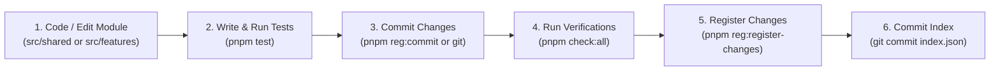

# Mason Registry (`@solid-stack/mason-registry`)

Official code registry for Solid Stack Clean Architecture shared modules and features.

The Mason Registry hosts reusable, production-ready modules that can be imported directly into applications using the [`mason import`](https://github.com/solid-stack-digital/mason) CLI.

---

## Table of Contents

- [Architecture & Module Types](#architecture--module-types)
- [Why You Must Never Manually Edit `index.json` or `registry.json`](#why-you-must-never-manually-edit-indexjson-or-registryjson)
- [Registry CLI Commands](#registry-cli-commands)
  - [Status & Drift Inspection](#status--drift-inspection)
  - [Module Registration & Updates](#module-registration--updates)
  - [Module Commits](#module-commits)
  - [Unregistering Modules](#unregistering-modules)
  - [Full Registry Build](#full-registry-build)
- [Module Scaffolding Commands](#module-scaffolding-commands)
- [Standard Development Workflow](#standard-development-workflow)
- [Linting & Code Quality Standards](#linting--code-quality-standards)
- [Clean Architecture & Dependency Rules](#clean-architecture--dependency-rules)
- [Verification & Quality Checks](#verification--quality-checks)

---

## Architecture & Module Types

The registry contains two categories of modules located in `src/`:

```
mason-registry/
├── index.json                  # Master registry catalog (generated by CLI)
├── src/
│   ├── shared/                 # Shared cross-cutting modules
│   │   ├── hasher/
│   │   ├── jwt/
│   │   ├── time/
│   │   └── uuid/
│   └── features/               # Domain feature modules
│       ├── authn/
│       ├── mailing/
│       └── otp/
└── scripts/
    ├── manage.ts               # Interactive & headless registry management CLI
    └── build.ts                # Master index builder & validation engine
```

1. **Shared Modules (`src/shared/<name>`)**: Reusable technical abstractions and utilities (e.g. clock/time abstraction, password hashing, JWT engine, UUID generator). Shared modules **never** depend on features.
2. **Feature Modules (`src/features/<name>`)**: Self-contained domain capabilities adhering to Clean Architecture (`domain/`, `useCases/`, `infrastructure/`, `pxExpress/`, `diProvider.ts`).

---

## Why You Must Never Manually Edit `index.json` or `registry.json`

Both `index.json` (at the root) and each module's `registry.json` are **managed artifacts**. You must never edit them manually.

### 1. Composite SHA-256 Integrity Verification
Every module's source files are deterministically hashed (excluding test files and manifests). When a consumer project runs `mason import`, it verifies the downloaded files against the registered `integrity` checksum. Manual modifications will invalidate the checksum, breaking module imports.

### 2. Git Commit Pinning & Decoupled Registrations
The registry records the exact git commit hash (`commit: "<hash>"`) for each module. This design allows you to:
- Commit iterative code changes to git without immediately publishing or registering them.
- Inspect drift between committed code and registered versions via `pnpm reg:status`.
- Register the module only when it has passed all tests, typechecks, and architectural validations.

### 3. Automated Pre-Registration Quality Gates
The registration commands (`pnpm reg:register`, `pnpm reg:register-changes`, `pnpm build`) enforce automated quality gates before any metadata is written:
- **Clean Git Working Tree**: Ensures no uncommitted files exist in the module directory.
- **Git Commit History**: Ensures a valid commit hash exists in git history.
- **Biome Linting**: Ensures 0 lint errors and 0 warnings under strict rules.
- **TypeScript Typechecking**: Ensures `tsc --noEmit` compiles cleanly.
- **Mason Architecture Linting**: Ensures dependency flow rules and no circular dependencies.

Manual edits bypass these quality checks and can introduce broken code, type errors, or architectural violations to consumer projects.

---

## Registry CLI Commands

All registry management actions can be run interactively or via positional arguments.

### Status & Drift Inspection

Inspect the status of all modules across the registry:

```bash
pnpm reg:status
# or
pnpm reg:diff
```

The output classifies every module into one of five states:
- 📦 **Unregistered Modules**: Exist on disk in `src/`, but not yet registered in `index.json`.
- 💾 **Uncommitted Changes in Git**: Modules with uncommitted changes in their working tree.
- 🚀 **Committed But Unregistered Changes**: Modules committed in git whose commit hash or integrity hash differs from `index.json`.
- ⚠️ **Missing on Disk**: In `index.json`, but the module folder is missing from disk.
- ✔ **Up to Date & Registered**: Clean working tree, matching commit hash, and valid checksum.

### Module Registration & Updates

#### Register a New Module
Registers an unregistered module into `index.json` and creates/updates its `registry.json`:

```bash
# Interactive mode (prompts for module type and name)
pnpm reg:register

# Headless / direct mode
pnpm reg:register feature authn
pnpm reg:register shared time
```

#### Register Module Changes
Updates an existing module in `index.json` with the latest commit hash, checksum, and file list:

```bash
# Interactive mode (select from drifted modules)
pnpm reg:register-changes

# Headless / direct mode
pnpm reg:register-changes feature authn
pnpm reg:register-changes shared jwt -v 1.1.0
```

*Note: Both registration commands will automatically abort if uncommitted changes exist, if there is no commit history, or if any lint/type/architecture checks fail.*

### Module Commits

Stage and commit changes for a specific module directly:

```bash
# Interactive mode
pnpm reg:commit

# Headless / direct mode
pnpm reg:commit feature authn -m "feat(authn): add email verification use case"
pnpm reg:commit shared time -m "feat(time): add Duration helpers"
```

### Unregistering Modules

Removes a module entry from `index.json` without deleting the source files on disk:

```bash
# Interactive mode
pnpm reg:unregister

# Headless / direct mode
pnpm reg:unregister feature authn
```

### Full Registry Build

Rebuilds the entire master `index.json` and all `registry.json` files while verifying every module:

```bash
pnpm build
```

This runs:
1. Full TypeScript typecheck (`tsc --noEmit`).
2. Architecture linting across all features (`mason lint --complete`).
3. Biome linting on every individual module directory.
4. Git commit validation and hash resolution for each module.

---

## Module Scaffolding Commands

Generate boilerplate modules and use cases adhering to Solid Stack Clean Architecture:

```bash
# Create a new feature module in src/features/<name>
pnpm create:feature <name>

# Create a new shared module in src/shared/<name>
pnpm create:shared <name>

# Create a new use case inside a feature module
pnpm create:usecase <feature-name> <usecase-name>
```

---

## Standard Development Workflow

When creating or modifying a module in `mason-registry`, follow this lifecycle:



1. **Develop**: Implement the module and its use cases in `src/`.
2. **Test**: Write Vitest unit tests (`*.test.ts`) and ensure all tests pass (`pnpm test`).
3. **Commit Code**: Commit the code changes in git (`pnpm reg:commit <type> <name> -m "..."`).
4. **Verify Quality**: Run `pnpm check:all` to ensure zero type errors, zero lint errors, and zero architectural violations.
5. **Register**: Run `pnpm reg:register-changes <type> <name>` (or `pnpm reg:register` for new modules).
6. **Commit Registry Index**: Commit `index.json` and `registry.json` (`git add index.json src/**/registry.json && git commit -m "chore: update registry index"`).

---

## Linting & Code Quality Standards

Because registry modules are imported directly into strict consumer codebases (such as backend APIs and frontend apps), all registry code must adhere to strict quality rules.

### TypeScript Configuration (`tsconfig.json`)
- `"strict": true`: Full strict typechecking enabled.
- `"verbatimModuleSyntax": true`: Enforces explicit `import type` for type-only imports.
- `"noUncheckedIndexedAccess": true`: Array and record lookups include `undefined` in their type signature.

### Biome Linter Configuration (`biome.json`)
- **`suspicious.noExplicitAny` (`error`)**: The `any` type is strictly forbidden. Use concrete interfaces or `unknown`.
- **`suspicious.noGlobalIsNan` (`error`)**: Use `Number.isNaN()` instead of the global `isNaN()`.
- **`style.noNonNullAssertion` (`error`)**: Non-null assertions (`!`) are forbidden. Use explicit conditional checks or error guards.
- **`style.useImportType` (`error`)**: Type imports must use `import type { ... }`.
- **`correctness.noUnusedImports` (`error`)**: Unused imports are treated as errors.
- **`correctness.noUnusedFunctionParameters` (`error`)**: Unused parameters are treated as errors.
- **`assist.source.organizeImports` (`"on"`)**: Biome automatically sorts and organizes imports deterministically.

---

## Clean Architecture & Dependency Rules

Features and shared modules follow Solid Stack Clean Architecture:

### 1. Direction of Dependency Flow
Dependency flow is **strictly one-way**:
- Features may depend on `shared` modules.
- Shared modules must **never** depend on features.
- A feature module must **never** have circular dependencies with another feature.

### 2. Inter-Feature Communication
Between two feature modules, only **one** feature can know about the other:
- If Feature A depends on Feature B, Feature B **must remain completely unaware** of Feature A.
- If the unaware Feature B needs to impose a side effect on Feature A, it must do so via **events, interfaces, or ports/adapters**, never via direct imports or dependencies.

### 3. Clean Architecture Layers
Inside each feature module:
- **`domain/`**: Pure business rules, entities, and domain repository/gateway interfaces. Zero dependencies on outer layers or external frameworks.
- **`useCases/`**: Application use cases orchestrating domain entities and interfaces.
- **`infrastructure/`**: Implementation of domain ports (e.g. database repositories, external API gateways, in-memory stubs for testing).
- **`pxExpress/`**: HTTP transport handlers and route registration.
- **`diProvider.ts`**: Dependency injection container bindings connecting interfaces to their infrastructure implementations.

---

## Verification & Quality Checks

The following npm scripts are available to validate the registry:

| Command | Description |
| :--- | :--- |
| `pnpm typecheck` / `pnpm check:types` | Runs `tsc --noEmit` to verify type correctness across the codebase. |
| `pnpm check:lint` | Runs `biome check --error-on-warnings src/ scripts/` to enforce formatting and lint rules. |
| `pnpm check:lint:fix` | Automatically formats files and fixes fixable Biome lint violations. |
| `pnpm check:arch` | Runs `mason lint --complete` to verify Clean Architecture and dependency flow rules across all features. |
| `pnpm test` | Runs the test suite via Vitest (`vitest run`). |
| `pnpm check:all` | Sequentially runs `check:types`, `check:lint`, and `check:arch`. |
| `pnpm check` | Runs full pre-flight verification: `check:all` + `test` + `build`. |
